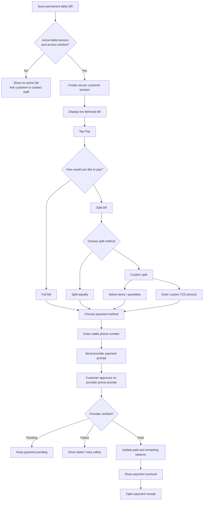
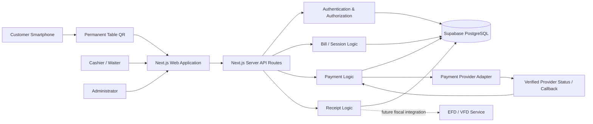
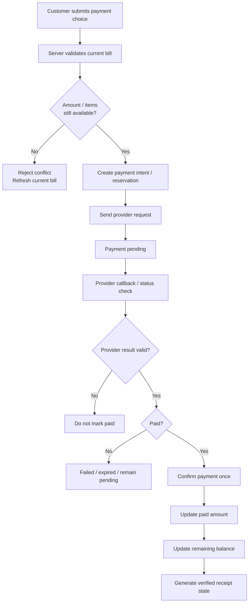
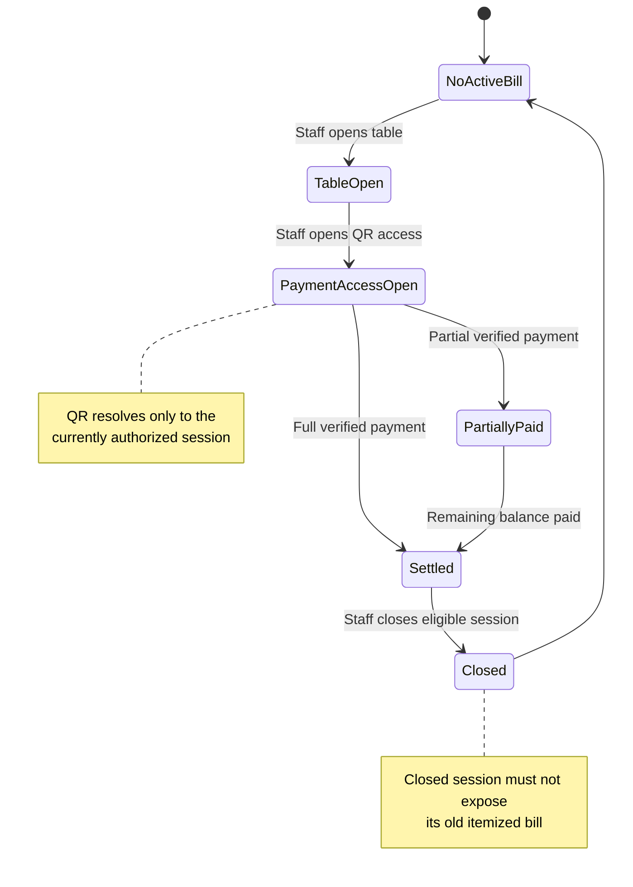
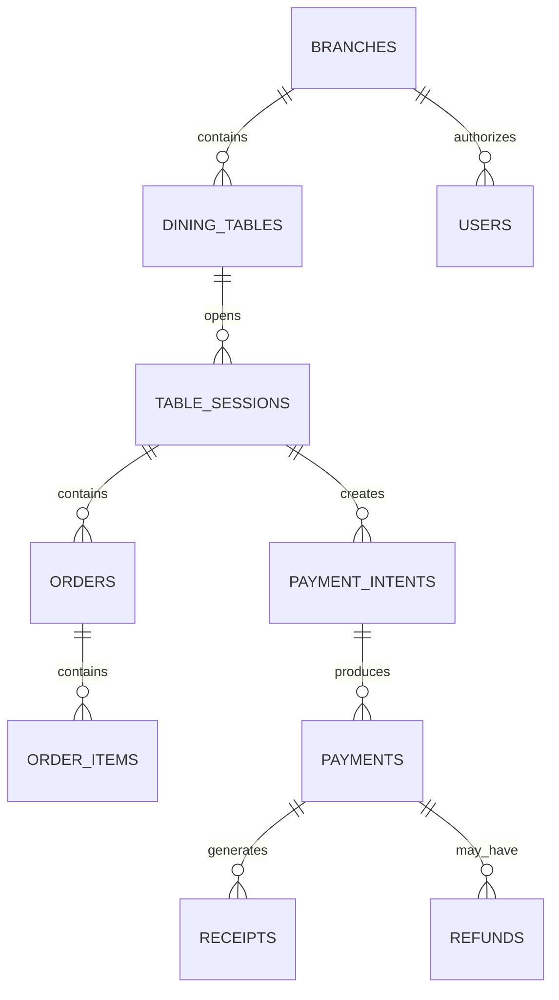
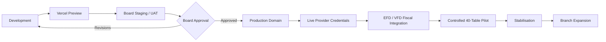

# Uzunguni City Park Secure Table Payment Web App

<p align="center">
  <strong>Scan. Check. Split. Pay.</strong><br>
  A secure, mobile-first table-bill viewing and payment experience for Uzunguni City Park.
</p>

<p align="center">
  
  
  
  
  
  
</p>

---

## Overview

The **Uzunguni City Park Secure Table Payment Web App** is a payment-only web application designed for restaurant guests to settle their table bill directly from a smartphone.

A guest scans the permanent QR code attached to the table, securely opens the active bill for that table, reviews the items entered by staff, chooses how to pay, completes payment, and receives a server-verified payment receipt.

The system is intentionally focused on **payment rather than ordering**:

- Customers do **not** create accounts.
- Customers do **not** download an application.
- Customers do **not** place or edit food orders.
- Staff remain responsible for entering and maintaining orders.
- A customer can only view the active bill for the table session they are authorized to access.
- A payment is considered successful only after it is verified by the backend/payment provider.

The project is being developed as a **Vercel-first pilot**, with production domain, live merchant credentials, permanent production QR labels, and final fiscal integration following controlled approval and testing.

---

## Business Scope

The platform is designed exclusively for **Uzunguni City Park** and supports the following branch locations:

| Branch |
|---|
| Arusha |
| Dodoma |
| Babati |
| Moshi |
| Korogwe |

The initial pilot is designed around **40 numbered tables** in one service area, while the data model can support additional tables and branches without redesign.

---

## Core Customer Journey



---

## Split Payment Model

The customer-facing flow is intentionally nested so the first payment decision stays simple.

```text
How would you like to pay?
│
├── Full bill
│
└── Split bill
    │
    ├── Split equally
    │   └── Enter number of people
    │
    └── Custom split
        │
        ├── Select items / quantities
        │
        └── Enter custom TZS amount
```

The underlying financial allocation types are:

| Type | Purpose |
|---|---|
| `FULL` | Pay the entire currently available remaining balance |
| `EQUAL` | Pay one equal share based on the selected number of people |
| `ITEM` | Pay selected available bill items or quantities |
| `CUSTOM` | Pay a valid custom amount that does not exceed the available remaining balance |

The backend remains authoritative for allocation, availability, amount validation, and final settlement.

---

## System Roles

### Customer

Anonymous browser user with access to one active table session.

The customer can:

- View the active bill.
- Review items and remaining balance.
- Choose a payment split.
- Select a supported payment method.
- Enter a mobile-money phone number.
- Wait for provider verification.
- View payment status.
- Open and print/save a payment receipt.

The customer cannot:

- Edit the order.
- Mark a payment as paid.
- Access staff information.
- Access another table.
- Access an older closed table session.
- Enter a mobile-money PIN into the Uzunguni website.

### Cashier / Waiter

Authenticated operational staff member.

The operator can:

- Open a table session.
- Enter items and quantities.
- Update permitted unpaid order data.
- Open and close customer QR access.
- Monitor payment state.
- View verified payment history.
- Print receipts where permitted.
- Close a settled table when server rules allow it.

### Administrator

Full-control staff role for sensitive operations.

Administrative responsibilities include:

- Staff/user management.
- Menu and price configuration.
- Branch/table management.
- QR management.
- Payment monitoring and reconciliation.
- Discount controls.
- Refund controls.
- Reports and audit review.
- Provider/fiscal configuration.

---

## System Architecture

The approved design separates customer, staff, payment, data, and fiscal responsibilities. The current Vercel pilot implements these responsibilities in a single Next.js repository backed by Supabase/PostgreSQL.



### Architectural Principles

- **Server authority** — prices, totals, allocations, access, and paid states are controlled or verified server-side.
- **Single source of truth** — financial/session state is persisted in PostgreSQL.
- **Provider isolation** — payment logic is kept separate from wallet/provider-specific behavior.
- **Financial immutability** — completed financial events should not be silently edited.
- **Branch isolation** — staff access is restricted to authorized operational scope.
- **Privacy by default** — customer access is anonymous and minimal payer information is retained.
- **Progressive scale** — the pilot favors a simple modular deployment before introducing unnecessary infrastructure.

---

## Payment Verification

The browser is never the source of payment truth.



A screenshot, browser redirect, manually edited page, or client-side success message is **not proof of payment**.

---

## Mobile Money Safety

For mobile-money payments:

1. The customer explicitly selects the wallet/provider.
2. The customer enters the wallet phone number.
3. The Uzunguni backend initiates the collection request.
4. The secure provider prompt appears on the customer's phone.
5. The customer enters the wallet PIN **inside the provider-owned prompt**.
6. Uzunguni waits for verified provider confirmation.
7. Only then can the payment become `PAID`.

> **Uzunguni must never request, transmit, store, or log a mobile-money PIN.**

Supported/defined wallet options in the product design include:

- M-Pesa
- Airtel Money
- Mixx by Yas
- HaloPesa
- Selcom Pesa
- AzamPesa

Only methods that are actually enabled and commercially/provider-approved should be exposed in production.

---

## Permanent QR Security Model

Each dining table has one permanent high-entropy QR identifier.

The QR itself does not permanently expose a bill.



Important controls:

- One active visit/session per table.
- Customer bill access is time-limited/controlled.
- Old table sessions must not reopen through the permanent QR.
- A table can close only when the server determines settlement conditions are satisfied.
- QR identifiers can be rotated if compromised.

---

## Receipt Model

After a verified payment, the customer can open a dedicated Uzunguni payment receipt.

The receipt is designed to contain:

- Uzunguni City Park identity.
- Branch/table information.
- Receipt/payment reference.
- Date and time.
- Payment allocation type.
- Relevant paid items where applicable.
- Amount paid.
- Payment method.
- Provider transaction reference.
- Remaining table balance.
- Server-verified payment status.
- VAT/fiscal fields when authoritative data is available.
- EFD/VFD receipt information after approved fiscal integration.

### Important Fiscal Boundary

The application receipt confirms the payment recorded by the Uzunguni system.

It must **not** be presented as an official TRA fiscal receipt until an approved EFD/VFD integration returns the required fiscal receipt number and verification information.

VAT values should come from the authoritative backend/fiscal calculation rather than being invented in the customer browser.

---

## Current Technology Stack

| Layer | Current Pilot Implementation |
|---|---|
| Frontend | Next.js 15 |
| UI | React 19 |
| Language | TypeScript |
| Backend | Next.js server/API routes |
| Database | Supabase PostgreSQL |
| Authentication | Supabase Auth / server authorization |
| Database access | `@supabase/supabase-js` and `@supabase/ssr` |
| QR generation | `qrcode` |
| Hosting | Vercel |
| Payment mode | Mock during controlled testing; live provider integration follows merchant approval |

---

## Project Structure

A simplified view of the current repository:

```text
The-Uzunguni-WebApp/
│
├── public/
│   └── images/
│
├── src/
│   ├── app/
│   │   ├── admin/
│   │   ├── api/
│   │   │   ├── admin/
│   │   │   ├── customer/
│   │   │   ├── order-items/
│   │   │   └── tables/
│   │   ├── auth/
│   │   ├── login/
│   │   ├── pay/
│   │   ├── q/
│   │   ├── staff/
│   │   └── waiter/
│   │
│   ├── components/
│   │   ├── CustomerBill.tsx
│   │   ├── CustomerBill.module.css
│   │   ├── TableWorkspace.tsx
│   │   ├── WaiterDashboard.tsx
│   │   ├── MenuManager.tsx
│   │   ├── QrGrid.tsx
│   │   └── StaffShell.tsx
│   │
│   └── lib/
│       ├── auth.ts
│       ├── payments/
│       ├── security/
│       └── supabase/
│
├── .env.example
├── middleware.ts
├── next.config.ts
├── package.json
├── tsconfig.json
└── README.md
```

---

## Environment Variables

Create `.env.local` in the project root.

```env
NEXT_PUBLIC_SUPABASE_URL=https://YOUR_PROJECT.supabase.co

NEXT_PUBLIC_SUPABASE_PUBLISHABLE_KEY=YOUR_PUBLISHABLE_OR_ANON_KEY

SUPABASE_SERVICE_ROLE_KEY=YOUR_SERVER_ONLY_SERVICE_ROLE_KEY

NEXT_PUBLIC_APP_URL=http://localhost:3000

PAYMENT_PROVIDER_MODE=mock
```

### Security Warning

Never expose or commit:

- `SUPABASE_SERVICE_ROLE_KEY`
- Live payment-provider secrets
- Webhook signing secrets
- Fiscal/EFD/VFD credentials
- Customer mobile-money PINs
- Card PAN/CVV information

`.env.local` must remain outside source control.

---

## Local Development

### Requirements

- Node.js 20+ recommended
- npm
- Supabase project configured for the application
- Project environment variables

### Install

```bash
npm install
```

### Start Development Server

```bash
npm run dev
```

On Windows, if PowerShell execution policy causes npm command issues, the project can also be started with:

```powershell
npm.cmd install
npm.cmd run dev
```

Then open:

```text
http://localhost:3000
```

### Production Build Test

Before pushing a release:

```bash
npm run build
```

Then:

```bash
npm start
```

---

## Vercel Pilot Deployment

The project uses a Vercel-first testing strategy.

### Board / UAT Stage

Use:

- A stable `vercel.app` deployment.
- Staging/test data.
- Mock or contracted sandbox payment flows.
- Temporary QR codes.
- TEST receipts.
- No live production merchant credentials.
- No claim that a test receipt is a legal TRA fiscal receipt.

Set:

```env
NEXT_PUBLIC_APP_URL=https://YOUR-PROJECT.vercel.app
```

Redeploy after changing the public URL so newly generated QR codes point to the correct public application.

### Production Stage

After approval:

1. Connect the final production domain.
2. Create separate production environment variables.
3. Use a separate production database/configuration.
4. Load live merchant credentials securely.
5. Enable verified provider callbacks/status verification.
6. Complete the approved EFD/VFD fiscal path.
7. Run low-value controlled live tests.
8. Generate and print permanent production table QR labels.
9. Launch the controlled 40-table pilot.
10. Monitor reconciliation, support issues, and payment exceptions before branch expansion.

---

## Recommended Test Scenario

```text
1. Administrator logs in.
2. Staff/waiter account is available.
3. Waiter opens a table session.
4. Waiter enters menu items and quantities.
5. Staff opens customer QR access.
6. Customer scans the table QR.
7. Customer sees only that table's active bill.
8. Customer selects Full Bill or Split Bill.
9. Customer chooses the required split path.
10. Customer selects a payment provider.
11. Customer enters a Tanzanian wallet phone number.
12. Payment request is created.
13. Provider/mock mode confirms the transaction.
14. Customer page changes to Payment Received only after server confirmation.
15. Remaining balance updates.
16. Customer opens the payment receipt.
17. Staff sees the verified transaction.
18. Once remaining balance reaches TZS 0 and no blocking payment is pending, staff closes the table.
19. The permanent QR no longer exposes the closed bill.
```

---

## Key Data Domains

The project data model covers the following main entities:



Historical financial data should remain stable even when menu names/prices later change, which is why order/receipt information should use transaction-time snapshots rather than depending on future menu edits.

---

## MVP Boundaries

The following are intentionally outside the payment MVP:

- Customer food ordering.
- Kitchen workflow.
- Delivery ordering.
- Customer registration or loyalty accounts.
- Full inventory/procurement management.
- Payroll/staff scheduling.
- Full accounting-ledger functionality.
- Storage of mobile-money PINs.
- Direct storage of bank-card PAN/CVV.
- Claiming an application-generated receipt is a TRA fiscal receipt before EFD/VFD integration.

---

## Design Language

The customer experience follows the Uzunguni premium visual system.

### Core Palette

| Token | Value |
|---|---|
| Uzunguni Red | `#830B0D` |
| Slate Gray | `#5D5D67` |
| Near Black | `#0B0C07` |
| Warm White | `#FCFBFA` |
| Red Tint | `#F4E7E7` |
| Neutral Surface | `#F1F1F3` |
| Divider | `#D9D9DE` |

The interface prioritizes:

- Bill clarity over decoration.
- One dominant decision per screen.
- Explicit payment states.
- Large mobile touch targets.
- Clear TZS amounts.
- English/Kiswahili-ready content.
- Status words/icons rather than color alone.
- Calm, dense staff interfaces for desktop operations.

---

## Project Delivery Path



The development strategy is deliberately staged so live financial credentials, permanent production QR labels, and fiscal claims are introduced only after controlled testing and approval.

---

## Design & Engineering Baseline

This project is based on the approved Uzunguni design documentation:

| Document | Purpose |
|---|---|
| `UZP-PRD-001` — Project Requirements Document | Business scope, users, controls, functional requirements, acceptance criteria |
| `UZP-FTD-002` — Functional & Technical Design | Architecture, APIs, payment logic, security, deployment |
| `UZP-UFD-003` — User Flow Diagrams | Customer, staff, provider, split-payment and verification journeys |
| `UZP-UXD-004` — Ultimate UI/UX Design Brief | Brand system, mobile customer experience, staff UI and receipt experience |
| `UZP-DBS-005` — Database Schema and Data Model | PostgreSQL entities, relationships, constraints and financial state |
| Premium UI Mockups v1.1 | Updated nested split flow, wallet selection, phone entry and provider-owned PIN prompt |
| `UZP-DEV-006` — Development Plan v1.1 | Vercel-first board/UAT and production rollout strategy |

Where payment-screen navigation differs between older diagrams and the later Premium UI Mockups v1.1, the updated nested flow is used:

```text
Full Bill / Split Bill
        ↓
Split Equally / Custom Split
        ↓
Select Items / Enter Custom Amount
```

---

## Product Principles

> **Scan. Check. Split. Pay. Receive a verified receipt.**

The system should always make three things clear:

1. **What the customer owes.**
2. **What has actually been verified as paid.**
3. **What remains on the table bill.**

Payment truth belongs to the backend and verified provider/fiscal systems — never to a screenshot or browser message.

---

## Project Owner

**Uzunguni City Park Secure Table Payment Web App**

Project Owner: **Alvin Mkilalu**

Repository:

```text
Alvinmkilalu/The-Uzunguni-WebApp
```

---

## License / Usage

This repository is developed specifically for the Uzunguni City Park payment system.

Unless a separate license is added, the source code should be treated as private/proprietary project material and not reused or redistributed without authorization.
